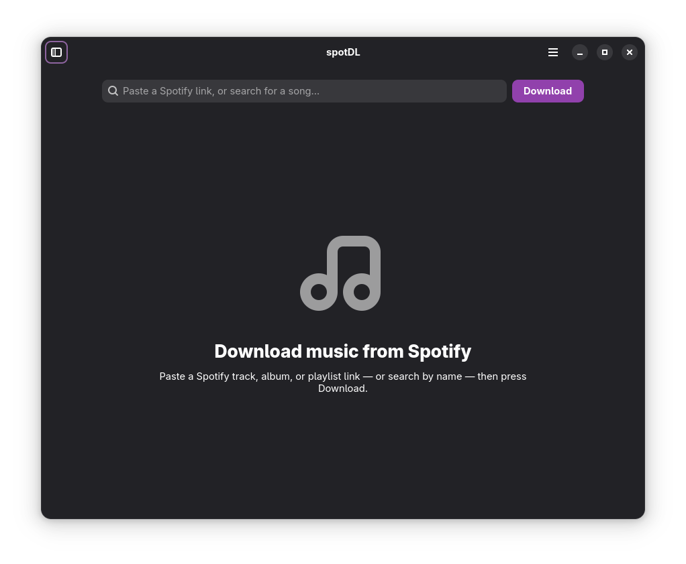

# spotDL.

<p align="center">
  
</p>

<p align="center">
  <strong>A native GNOME desktop app for downloading music from Spotify</strong><br/>
  GTK4 · libadwaita · Flatpak · Linux
</p>

<p align="center">
  <a href="https://github.com/loafdaddy/spotDL-GNOME/releases/latest"></a>
  <a href="packaging/flatpak/io.github.loafdaddy.SpotdlGnome.yml"></a>
  <a href="pyproject.toml"></a>
  <a href="LICENSE"></a>
</p>

<p align="center">
  <a href="https://github.com/loafdaddy/spotDL-GNOME/releases/tag/v0.2.1">v0.2.1</a>
  ·
  <a href="SETUP.md">Setup</a>
  ·
  <a href="docs/RELEASES.md">Releases</a>
  ·
  <a href="CONTRIBUTING.md">Contributing</a>
  ·
  <a href="docs/README.md">Docs index</a>
</p>

spotDL finds songs from your Spotify tracks, albums, and playlists on YouTube and downloads them — complete with album art, lyrics, and metadata. This Linux fork wraps the [spotDL](https://github.com/spotDL/spotify-downloader) engine in a native **GTK 4 / libadwaita** interface, packaged as a self-contained **Flatpak**.

Built to feel like it ships with Fedora Workstation: Wayland-first, Flatpak-friendly, no Electron.

## Why spotDL?

Most Spotify download tools are CLIs or Electron shells. spotDL gives you a calm native GNOME window: paste a link, watch progress, retry failures, and keep downloads organised for a music library.

> Paste a Spotify link → download organised files → play them in your music library.

## Features

- 🎵 Paste a Spotify track, album, or playlist URL and download
- ⏳ Live progress with a loading phase so the first download never feels frozen
- 🔁 Automatic backup sources (YouTube Music → YouTube → SoundCloud → Bandcamp)
- ❌ Inline error reasons and per-track **Retry**
- 📁 Organised folders (default `Album artist / Album /`), configurable in Preferences
- 🕘 Download history sidebar
- 🎚️ Format & quality settings (mp3, flac, opus, m4a, ogg, wav), bitrate, threads, synced lyrics
- 📦 FFmpeg and Deno bundled in the Flatpak

<p align="center">
  
</p>

> **Screenshots** — more UI captures welcome. See [docs/assets/](docs/assets/) (placeholder GIFs can live here too).

## Quick start

**Flatpak is the product runtime.** Full walkthrough: **[SETUP.md](SETUP.md)**.

```bash
# Install the bundle from the latest GitHub release
flatpak install --user ./io.github.loafdaddy.SpotdlGnome.flatpak
flatpak run io.github.loafdaddy.SpotdlGnome
```

Build from source:

```bash
git clone https://github.com/loafdaddy/spotDL-GNOME.git
cd spotDL-GNOME
./packaging/flatpak/build.sh
flatpak run io.github.loafdaddy.SpotdlGnome
```

## Docs

| Doc | What it covers |
|-----|----------------|
| **[SETUP.md](SETUP.md)** | Flatpak install, first run, preferences |
| [docs/CONFIGURATION.md](docs/CONFIGURATION.md) | Output path, formats, bitrate, lyrics |
| [docs/ARCHITECTURE.md](docs/ARCHITECTURE.md) | Engine, GUI, Flatpak layout |
| [docs/FAQ.md](docs/FAQ.md) | Common questions |
| [docs/RELEASES.md](docs/RELEASES.md) | Version history and how to cut a release |
| [docs/ROADMAP.md](docs/ROADMAP.md) / [docs/TODO.md](docs/TODO.md) | Direction and status |
| [CONTRIBUTING.md](CONTRIBUTING.md) | Contributor workflow |
| [data/brand/README.md](data/brand/README.md) | Lockup, mark, palette |

## Requirements

- Linux with Flatpak (Fedora, Ubuntu, etc.)
- GNOME Platform runtime (pulled automatically from Flathub when installing)
- A Spotify link for tracks, albums, or playlists

Details: [SETUP.md](SETUP.md).

## Configuration

Preferences live in the app menu (**Preferences**) and are stored in spotDL’s shared config. Typical choices:

- Download folder
- Audio format and bitrate
- Folder template (`{artists}/{album}/…`)
- Threads and synced lyrics

Examples and defaults: [docs/CONFIGURATION.md](docs/CONFIGURATION.md).

## Usage

1. Open spotDL.
2. Paste a Spotify URL (or try a name search — experimental).
3. Press **Download**.
4. Open the finished folder from the toast, or browse **History**.
5. Play files in your music library or any local player.

CLI engine notes inherited from upstream: [docs/usage.md](docs/usage.md).

## Development

```bash
git clone https://github.com/loafdaddy/spotDL-GNOME.git
cd spotDL-GNOME
python -m venv --system-site-packages .venv && source .venv/bin/activate
pip install -e ".[gui]"
python -m spotdl.gui
```

Full contributor loop: [CONTRIBUTING.md](CONTRIBUTING.md) · [docs/DEVELOPMENT.md](docs/DEVELOPMENT.md).

## Docker

This fork’s supported desktop path is **Flatpak**, not Docker. Upstream spotDL still documents Docker for the CLI — see [docs/installation.md](docs/installation.md) if you need that.

## Music sourcing & legal

spotDL uses YouTube (and backup sources) for downloads. The highest available bitrate is used (128 kbps for regular YouTube, up to 256 kbps for YouTube Music premium accounts).

> **Note**
> Users are responsible for their actions and any potential legal consequences. We do not support unauthorised downloading of copyrighted material and take no responsibility for user actions.

## FAQ

**Does spotDL play music?**  
No. It downloads and tags files. Use your preferred music library or player.

**Is free-text search supported?**  
Experimental. Pasting a Spotify link is the reliable flow.

**Windows / macOS?**  
This fork targets Linux / Flatpak only.

More: [docs/FAQ.md](docs/FAQ.md).

## Upcoming

From [docs/ROADMAP.md](docs/ROADMAP.md) (day-to-day: [docs/TODO.md](docs/TODO.md)):

- First-class Spotify search
- Optional drag-and-drop of links
- Flathub distribution
- More UI polish that fits Adwaita

## Contributing

See [CONTRIBUTING.md](CONTRIBUTING.md). Focused PRs and AI-assisted contributions are welcome.

Parts of this fork — including the GTK GUI, Flatpak packaging, docs, and branding — may have been written or edited with AI assistance. Contributors remain responsible for what they submit.

## Credits

Built on the [spotDL](https://github.com/spotDL/spotify-downloader) engine. Same studio family as [Discoverr](https://github.com/loafdaddy/discoverr-bot).

## License

MIT. See [LICENSE](LICENSE).
